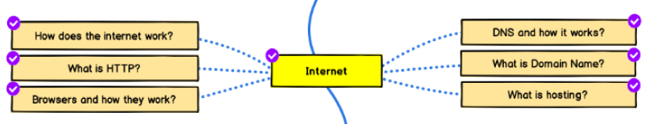

# Front-end Roadmap Cursos

> Uma lista com curadoria de cursos de front-end seguindo o [roadmap.sh](./frontend.png) 
---

### Internet

- Como a internet funciona?
  - [Artigo] [Como a internet funciona](https://developer.mozilla.org/pt-BR/docs/Learn/Common_questions/Como_a_internet_funciona) - MDN - free - 🇧🇷  
  
- O que é HTTP?
  - [Artigo] [Entenda o que é HTTP](https://rockcontent.com/blog/http/) - Rockcontent - Free - 🇧🇷
  
- Navegadores a como eles funciona?
  - [Video] [como funcionam os navegadores web](https://hipsters.tech/como-funcionam-os-navegadores-web/) - Hipsters - Free - 🇧🇷
   
